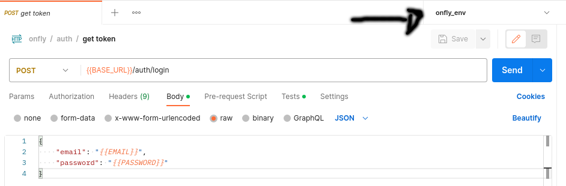

<div align="center">
 <h1> ✈️ Projeto onfly 🌎</h1>
</div>

- Clone o projeto (caso você esteja usando windows, pelo wsl 2):

```
git clone https://github.com/HugooSantos/onfly.git ; cd onfly
```
- Dentro da pasta onfly vamos copiar o .env.example do laravel e já fazer as alterações necessárias:

```
cp .env.example .env
```

- Dentro do arquivo .env vamos mexer nas configurações das constantes 

> Primeiro a do banco de dados:

```
DB_CONNECTION=mysql
DB_HOST=onfly
DB_PORT=3306
DB_DATABASE=onfly
DB_USERNAME= seu user
DB_PASSWORD= sua senha 
```

> Agora a de e-mail (Caso precise de uma plataforma para configurar essas constantes recomendo a 
[mailtrap](https://mailtrap.io/)):

```
MAIL_MAILER=smtp
MAIL_HOST=seu host
MAIL_PORT=sua porta
MAIL_USERNAME=seu email
MAIL_PASSWORD=sua senha
MAIL_ENCRYPTION=tls
QUEUE_DRIVER = database
```
- Vamos usar o docker como ambiente de desenvolvimento/teste, use o seguinte comando dentro do projeto:

```
docker build -t onfly . ; docker-compose up -d
```

- Esse processo pode demorar um pouco, então que tal já irmos importando a sua colection do postman? 

> Collection : [Collection](https://drive.google.com/uc?export=download&id=1h_cQozveOSt7_TSqemM4x0BPq7V45Ke1)

> Env : [env](https://drive.google.com/uc?export=download&id=1B4cgnj9Z8fXlAqTn0ZQO_xouXyeFvNOn) 

- Lembre de colocar o env do seu postman para facilitar o processo de teste:

<br>
<div align="center">
  
</div>
<br>

- Agora vamos acessar dentro do container (todos os comandos abaixo vão ser rodados dentro do container):
```
docker exec -it onfly-app bash
```
- Vamos rodar o composer install

```
composer install
```

- Gerar a chave do laravel

```
php artisan key:generate
```

- E agora gerar a chave para o token JWT 

```
php artisan jwt:secret
```

- Agora vamos rodar o migrate para criar as tabelas:
```
php artisan migrate
```

- Para executar os testes você irá usar:
```
php artisan test
```
- Abra um novo terminal (não feche o atual) e rode:

```
docker exec -it onfly-app bash
```
- Rode o worker para envio de emails dentro desse novo terminal:

```
php artisan queue:work
```